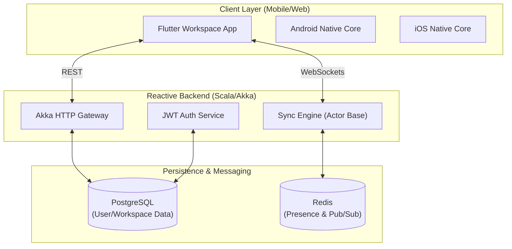
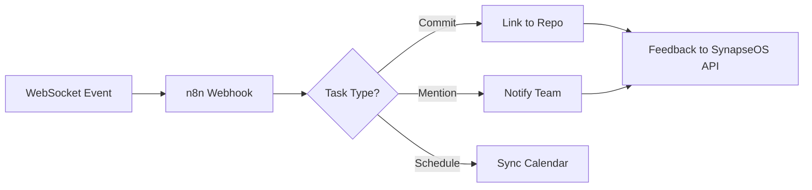

# 🧠 SynapseOS: Real-Time Neural Workspace

> **The definitive production-grade, distributed collaboration engine. Unifying communication, whiteboarding, and task management into a single, synchronized neural fabric.**

---

## ⚡ Quick Start

```powershell
# Verify system integrity
.\verify_synapse.ps1

# Run the ecosystem
docker-compose up -d
cd backend-scala; sbt run
cd flutter-app; flutter run
```

---

## 🚀 Vision & Problem
Modern teams are fragmented by tool-switching. **SynapseOS** solves this by providing a high-performance **Reactive Sync Engine** built on Scala/Akka, paired with a stunning **Cross-Platform Flutter UI**. It transitions from a simple app to a **Distributed System** designed for high availability and sub-100ms latency.

---

## 🏛 System Architecture (C4 Model)



---

## 🛰 n8n Automation Workflow

SynapseOS leverages **n8n** for intelligence-driven task automation and third-party integrations.



---

## 📂 Repository Structure

```text
Synapse_OS/
├── backend-scala/         # Akka-based Distributed API & Sync Engine
├── flutter-app/           # Premium Multi-platform UI (BLoC + Custom Painter)
├── android-kotlin/        # Native Android Layer (Room + Coroutines)
├── ios-swift/             # Native iOS Layer (SwiftUI + Combine)
├── docs/                  # Architecture, TEST_PLAN, and ADRs
├── .github/workflows/     # CI/CD (GitHub Actions)
├── docker-compose.yml     # Local Infrastructure
└── verify_synapse.ps1     # Integrity Verification Script
```

---

## 💎 Premium Features

### 1. High-Performance Whiteboard
- Real-time stroke synchronization via WebSockets.
- Optimized canvas rendering with Flutter's CustomPainter.
- Sub-ms event broadcasting via Akka Actors.

### 2. Neural Chat & Presence
- Glassmorphic UI with micro-animations.
- Global presence tracking with Redis.
- Full message persistence with PostgreSQL.

### 3. Strategy Kanban
- Drag-and-drop task management.
- Real-time updates for collaborative planning.
- RBAC-secured workspace permissions.

---

## 🔒 Production Hardening

> [!IMPORTANT]
> This project is built for institutional-grade reliability.

- **Security**: JWT-based stateless auth + RBAC (Role-Based Access Control).
- **Observability**: SLF4J logging, Health Checks, and Prometheus-ready Metrics.
- **Reliability**: Multi-stage Docker builds and automated sbt/flutter test suites in CI.
- **Sustainability**: Explicit ADRs (Architecture Decision Records) and full contract schemas.

---

## 🤝 Contributing

Contributions are what make the open source community such an amazing place to learn, inspire, and create. Please read [CONTRIBUTING.md](CONTRIBUTING.md) for details on our code of conduct and the process for submitting pull requests.

---

## 📜 License

Distributed under the MIT License. See `LICENSE` for more information.

---

<p align="center">
  Generated with ❤️ by <b>Antigravity</b> for <b>SynapseOS</b>
</p>
