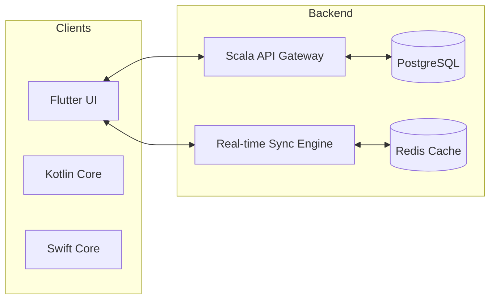

# SynapseOS Architecture

## High-Level System Design

## Real-Time Synchronization Flow

1. **Authentication**: Client sends JWT via WebSocket handshake.
2. **Connection**: Backend validates token and assigns user to a `WorkspaceActor`.
3. **Broadcasting**: Any event (cursor, draw, text) is sent to the `WorkspaceActor` and broadcasted to all active members of that workspace.
4. **Consistency**: Use of **Operational Transformation (OT)** concepts to resolve conflicting edits in documents.

## Performance Considerations
- **Non-blocking I/O**: Leveraging Akka Streams and Actors for high-concurrency WebSocket management.
- **Horizontal Scaling**: Use of Redis Pub/Sub for cross-instance event broadcasting in a clustered environment.
